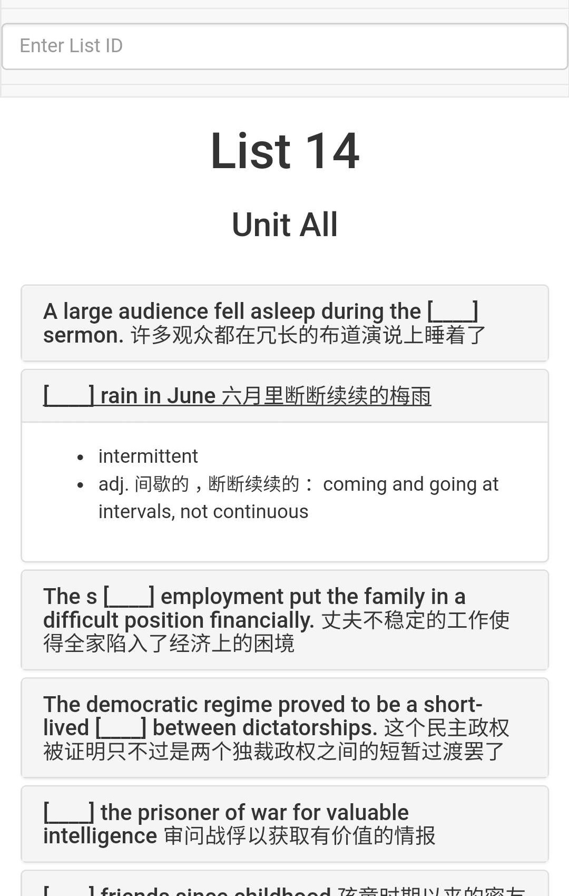
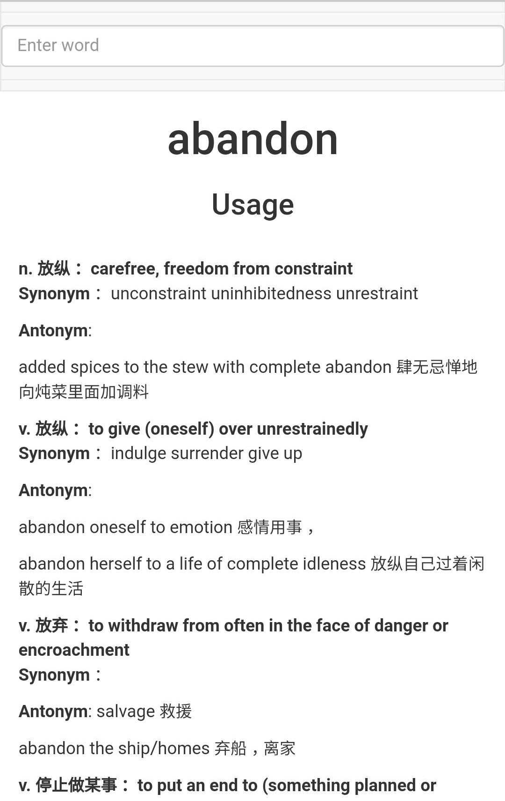

# GRE-3000-Memory-Helper

usage：
> python manage.py runserver 0.0.0.0:8000

即可从所有本机IP进入服务器。
# 功能
1. 例句模式。将《GRE再要你命3000词》中的例句按照规则提取改编，辅助单词记忆。
2. 查词模式。囊括书中的主要词汇与同反义词出现的词汇。主要用况：**查词后发现原来单词早就在书中背过，让你自责不已，从此发愤图强。**

Verbal请通过[host]/verbal?lid=[list ID]&uid=[unit ID] 访问。不指定[list ID]会响应404.

static/data.json 原始数据为知名论坛bbs.zhan.com下载的《再要你命3000》。通过在线PDF转TXT解析并通过简单的规则结构化。按照源文件的说明，请不要用于商业用途。

> 没有什么软件是CS的同学找不到的；如果有，就自己写一个
